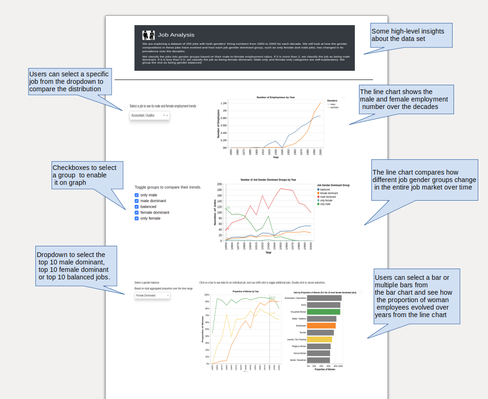
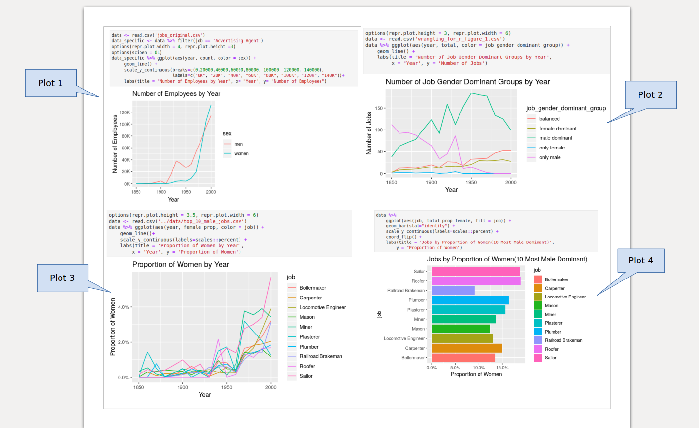

## Job Analysis Application

The `Job Analysis` app is a single-page app to provide insights about the [jobs dataset](https://github.com/vega/vega-datasets/blob/master/data/jobs.json) provided by [vega-datasets](https://github.com/vega/vega-datasets/blob/master/README.md). The dataset has information about 255 different jobs and the distribution of genders to those jobs over time.

The first graph is a line chart showing the male and female employment numbers over the decades. From the dropdown lists, users can select a job to compare the distribution of male and female employment.

In the second graph, a user will be able to see and compare how different job gender groups, including balanced, female dominant, male dominant, only female and only male groups, change in their respective proportions in the entire job market over time. The user can also filter the groups by toggling.

In the third graph, a user will be able to view how the proportion of woman employees has evolved in the top 10 most male dominant, female dominant and balanced jobs. A user can pick which top 10 jobs they want to explore from the dropdown list and the bar chart shows the proportion of women employees in these jobs. To see the proportion of women over decades for an individual job, users can click on a bar and also by shift+click users will be able to toggle additional jobs.

[App link](https://jobs-analysis-milestone2.herokuapp.com/)

Sketch below shows how the main page will look approximately.
  

------
## Current Progress

